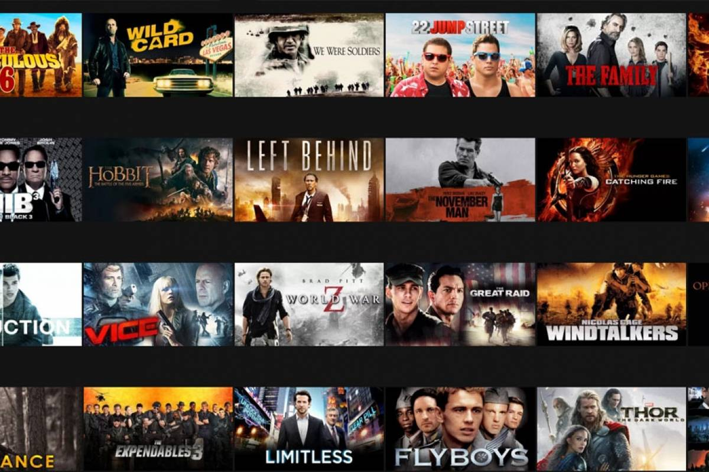

```{r packages-setup, include = FALSE}
library(tidyverse)
library(klippy)  #- remotes::install_github("rlesur/klippy")
library(knitr)
library(readxl)
library(dplyr)
library(ggplot2)
library(ggThemeAssist)
library(scales)
library(plotly)
library(gapminder)
library(gganimate)
library(reactable)
library(gt)
```

```{r chunk-setup, include = FALSE}
knitr::opts_chunk$set(echo = TRUE, eval = TRUE, message = FALSE, warning = FALSE, 
                      #results = "hold",
                      cache = FALSE, cache.path = "/caches/", comment = "#>",
                      #fig.width = 7, #fig.height= 7,   
                      #out.width = 7, out.height = 7,
                      collapse = TRUE,  fig.show = "hold",
                      fig.asp = 7/9, out.width = "60%", fig.align = "center")
knitr::opts_chunk$set(dev = "png", dev.args = list(type = "cairo-png"))
```

```{r options-setup, include = FALSE}
options(scipen = 999) #- para quitar la notación científica
options("yaml.eval.expr" = TRUE) 
```


```{r klippy, echo = FALSE}
klippy::klippy(position = c("top", "right")) #- remotes::install_github("rlesur/klippy")
```

-----------------

Trabajo  elaborado para la asignatura "Programación y manejo de datos en la era del Big Data" de la Universitat de València durante el curso 2020-2021. La página web de la asignatura puede verse aquí: <https://perezp44.github.io/intro-ds-20-21-web/>. Los trabajos de nuestros compañeros de curso pueden verse [aquí](https://perezp44.github.io/intro-ds-20-21-web/07-trabajos.html).

---------------

<br>

# 1. Introducción

Este trabajo consiste en un estudio de las diferentes películas y series de netflix. Con este análisis queremos poner en práctica lo estudiado en la asignatura de Programación y manejo de datos en la era del Big Data.

# 2. ¿Qué es?

Netflix es un servicio de streaming que funciona mediante suscripción y permite a sus usuarios ver series y películas, sin anuncios, a través de cualquier dispositivo conectado a internet.   

También se pueden descargar series y películas en cualquier dispositivo iOS, Android, o Windows 10 y verlas sin necesidad de conexión a internet.

 


# 3. Un poco de hisotria

La compañía no tuvo éxito desde un comienzo, pero las buenas acciones de sus desarrolladores la llevaron a obtener las ganancias que tiene hoy en día.

En sus principios, Netflix era una compañía que alquilaba DVD’s, se fundó en 1997, y fue en 1998 donde alquiló su primer DVD. La empresa comenzó alquilando películas por esta modalidad.


- En 2007, Netflix inicia su servicio de VOD en Estados Unidos para computadoras personales. 

- A partir de 2008 se agregan diferentes opciones para acceder al catálogo por retransmisión en directo. 

- En 2009 su catálogo físico ofrece 100 mil títulos y su clientela supera los 10 millones de suscriptores.

- En 2011, la empresa inicia operaciones por primera vez fuera del territorio estadounidense y canadiense, ofreciendo su catálogo por retransmisión en directo en la región de América Latina y el Caribe. 

- En 2012 ofrece sus servicios en algunos países de Europa.  

- En 2016 ofrece sus contenidos a todo el mundo con excepción de la región de Crimea, y los territorios de Corea del Norte, China y Siria.


# 4. Análisis de la oferta audiovisual de Netflix




## 4.1 Datos analizados

El contenido de Netflix varía según la región, y puede cambiar con el tiempo. Su oferta incluye una gran variedad de galardonados títulos originales de Netflix, series, películas, documentales y mucho más.

A lo largo de este análisis vamos a utilizar las siguientes rutas de datos.


```{r, include = TRUE, echo=TRUE}
netflix <- read_excel("./Datos/netflix_titles.xlsx")
netflix <- netflix %>% select(-show_id, -cast, -description, -rating)
suscriptores <- read_excel("./Datos/suscriptores11.xlsx")
```

La tabla 'netflix' nos da los datos de las Movies y TVShows que Netflix tiene en su página. Nos indica el título de cada una de ellas, su director, la ciudad donde fueron producidas, la fecha que se estrenaron y la que se subieron a la plataforma de Netflix, la duración y el género.

Con la función anterior hemos arreglado los datos de netflix_titles y eliminado las columnas 'show_id', 'coast', 'description' y 'ratiing'.


## 4.2. Gráfico TVShows Vs Movies en el tiempo 

```{r, echo = TRUE, eval = TRUE}
cuatro <- netflix %>% group_by(type, release_year)%>% count()
cuatro1 <- ggplot(cuatro, aes(x = release_year, y = n)) + geom_area(aes(color = type, fill = type),
alpha = 0.5, position=position_dodge(0.8))+ scale_color_manual(values=c("#00AFBB","#E7B800"))+ scale_fill_manual(values=c("#00AFBB","#E7B800"))
cuatro1+labs(title = "TVShows y Movies en el tiempo")

```

La compañía no tuvo éxito desde un comienzo, pero las buenas acciones de sus desarrolladores la llevaron a obtener las ganancias que tiene hoy en día.

En sus principios, Netflix era una compañía que alquilaba DVD’s, se fundó en 1997, y fue en 1998 donde alquiló su primer DVD. La empresa comenzó alquilando películas por esta modalidad.


## 4.3 Películas y series ordenadas por años de producción

Lo primero que vamos a hacer es ordenar las películas y series de más antigua a más nueva y después mover la columna "release_year" a la izquierda de todo.

```{r, echo = TRUE, eval = TRUE}
grafico2 <- netflix %>% arrange(release_year)
grafico2.1 <- grafico2 %>% select(release_year, everything())

```

Cogiendo como referencia la tabla del trabajo de Noelia Sánchez, Ignacio Montava y Andreu Esparza, hemos realizado la siguiene tabla en a que se pueden buscar las distintas Movies y TV Show por diferentes filtros.

```{r eval=TRUE, echo=FALSE}

reactable(grafico2.1, defaultPageSize =  10,  paginationType = "jump", showPageSizeOptions =  TRUE , pageSizeOptions =  c ( 10 , 50 , 100 ),defaultColDef = colDef(
    align = "center",
    minWidth = 70,
    headerStyle = list(background = "red"),
    filterable = TRUE),  highlight = TRUE, outlined = TRUE,
    columns = list(
  `Movies&TVShow/año` = colDef(style = function(value) {
    if (value > 0) {
      color <- "#e00000"}
      else {
      color <- "#008000"
    }
    list(color = color, fontWeight = "bold")
  })))

```

Como podemos observar en la tabla anterior, la serie más antigua que existe en la plataforma de Netflix es "Pioneers: First Women Filmmakers"

```{r, echo = FALSE, eval = TRUE, out.width = "50%", fig.align = "center"}
knitr::include_graphics(here::here("imagenes", "primera_serie.jpg") ) 
```

La película más antigua que se encuentra en la plataforma es, "Prelude to War", una película estadounidense basada en la Segunda Guerra Mundial y cuyo director es Frank Capra.

```{r, echo = FALSE, eval = TRUE, out.width = "50%", fig.align = "center"}
knitr::include_graphics(here::here("imagenes", "primera_pelicula.jpg") ) 
```


## 4.4 Los diez directores con más películas

En la siguiente tabla se pueden observar los diez directores que más películas han realizado.

```{r, echo = TRUE, eval = TRUE}
grafico4 <- netflix %>% filter(type == "Movie") %>%group_by(director) %>% summarise(Películas=n()) %>% na.omit(datos) %>% slice_max(Películas,n =10)
grafico41 <- grafico4 %>% mutate(director = forcats::as_factor(director))

```


```{r eval=TRUE, echo=FALSE}
knitr::kable(director <- grafico41)

```

De forma más visual se puede observar lo anteriormente mostrado en el siguiente gráfico. Raúl Campos y Jan Suter son los directores con diferencia que más películas han realizado.

```{r, echo = TRUE, eval = TRUE}

graficodirectores1 <- ggplot (grafico41, aes(x=director, y = Películas), aes(fct_rev(director))) + geom_bar(stat="identity", fill = "red") + coord_flip() + labs(x = "Director", y = "Número de películas")+labs(title = "Diez directores con más películas")
ggplotly(graficodirectores1)
```


## 4.5 Los díez países con más películas. 

El país con más películas producidas que hay en la plataforma de Netflix es Estados Unidos y el segundo es India.

Sorprende que India sea de los paises que tiene más producción de cine y esto se debe a la industria cinematográfica ubicada en una de sus ciudades más pobladas, Bombay. Esta ha desbancado en el número de producción de películas a Hollywood, y es que en Bollywood se producen cada año más de 1.000 cintas o películas.

```{r, echo = TRUE, eval = TRUE}
grafico4 <- netflix %>% filter(type == "Movie") %>%group_by(country) %>% summarise(Países=n()) %>% na.omit(datos) %>% slice_max(Países,n =10)
grafico41 <- grafico4 %>% mutate(country = forcats::as_factor(country))
d <- ggplot (grafico41,aes(x=country, y = Países), aes(fct_rev(country))) + geom_bar(stat="identity", fill = "black") + coord_flip()
d + labs(title = "Gráfico de los 10 países con más películas producidas",
       caption = "Datos provenientes del netflix_titles dataset",
       x = "País",
       y = "Número de Películas",
       color = "Especie de lirio")
```

Hemos creado un mapa para mostrar estos diez paises.

```{r, echo = TRUE, eval = TRUE}
world <- rnaturalearth::ne_countries(scale = "medium", returnclass = "sf") 
world1 <- world %>% filter (admin %in% c("Japan", "Hong Kong", "France", "Mexico", "Turkey", "Spain", "Canada", "United Kingdom", "India", "United States of America"))

world2 <- world %>% filter(!(admin %in% c("Japan", "Hong Kong", "France", "Mexico", "Turkey", "Spain", "Canada", "United Kingdom", "India", "United States")))

world3 <- ggplot () + geom_sf(data = world2) + geom_sf(data = world1, fill = "black") +  labs(title = "Países con más películas en Netflix",  caption = "Elaboracion propia") + theme(panel.grid.major = element_line(color = gray(.8), linetype = "dashed", size = 0.05), panel.background = element_rect(fill = "gray")) + coord_sf(xlim = c(-160, 160), ylim = c(-50, 80), expand = FALSE) + 
annotate(geom = "text", label = "1482", size = 4, x = -72.5, y = 43, color = "RED") +
annotate(geom = "text", label = "80", size = 4, x = -4, y = 42.5, color = "RED") + 
annotate(geom = "text", label = "170", size = 4, x = -1, y = 55, color = "RED")  + 
annotate(geom = "text", label = "50", size = 4, x = 3, y = 50,color = "RED") +
annotate(geom = "text", label = "55", size = 4, x = 35.18, y = 38.84, color = "RED") + 
annotate(geom = "text", label = "724", size = 4, x = 79.89, y = 20.95, color = "RED") + 
annotate(geom = "text", label = "88", size = 4, x = -101.11, y = 55.29, color = "RED") + 
annotate(geom = "text", label = "54", size = 4, x = -99.27, y = 19.67, color = "RED")+
annotate(geom = "text", label = "49", size = 4, x = 114.10, y = 22.39, color = "RED")+ 
annotate(geom = "text", label = "47", size = 4, x = 139.41, y = 36.72, color = "RED")
world3
```

## 4.6 Gráfico porcentaje TvShows Vs Movies

Con este gráfico podemos ver que en la oferta de Netflix predominan las películas frente a las series. El porcentaje de películas es de aproximadamente un 68% frente al 32% de series.

```{r, echo = TRUE, eval = TRUE}
grafico6 <- netflix %>% group_by(type) %>% summarise(NN=n()) %>% mutate(prob = prop.table(NN)*100)
grafico61 <- ggplot(grafico6, aes(x = "", y = prob, fill = prob))+geom_bar(stat="identity", color = "white") + geom_text(aes(label=prob),position=position_stack(vjust=0.5), color="white", size=5) + coord_polar(theta="y") + theme_void()
grafico61+labs(title = "Movies Vs Tv SHows")

```


## 4.7 Las diez películas más largas

En este apartado hemos tenido que modificar en primer lugar, la columna donde se mostraba la duración, ya que inicialmente la celda contenía letras y números (ejemplo: 90 min), y crear dos nuevas columnas donde en una pusiera el número y en la otra las letras. De este modo poder trabajar los datos. En segundo lugar, habiendo creado las dos columnas, hemos tenido que modificar el formato de los datos de la columna que contenía los números, ya que estaba en formato letra, y no leía bien los datos. 
Dicho esto, a continuación podemos observar las diez películas más largas de la plataforma Netflix. 


```{r, echo = TRUE, eval = TRUE}
i <-   separate(data = netflix, col = "duration", into = c("duracion", "tipo"), sep = " ") %>% mutate(duracion = as.numeric(duracion)) %>% filter (tipo == "min") %>% top_n(duracion, n = 10) %>% mutate(duracion = forcats::as_factor(duracion)) 
```

```{r eval=TRUE, echo=FALSE}
knitr::kable(Movies <- i)

```


## 4.8 TV Shows lanzados por año de producción

En este apartado hemos aislado los datos de TVShows para poder realizar el gráfico correspondiente.

```{r, echo = TRUE, eval = TRUE}
i2 <-   separate(data = netflix, col = "duration", into = c("duracion", "tipo"), sep = " ") %>% mutate(duracion = as.numeric(duracion)) %>% filter (tipo == "Season") %>% mutate(duracion = forcats::as_factor(duracion)) 
```

```{r, echo = TRUE, eval = TRUE}

grafico4.8 <- i2 %>% group_by(release_year) %>% summarise(NN=n())
b <- ggplot (grafico4.8, aes(x = release_year, y = NN)) + geom_bar(stat = "identity", fill = "steelblue")
b + labs(title = "Gráfico: TVShows por año",
       subtitle = "(diferenciando por año)",
       caption = "Datos provenientes del netflix_titles dataset",
       x = "Release_year",
       y = "NN",
       color = "Especie de lirio")
```

# 5. Evolución de los suscriptores

```{r, echo = TRUE, eval = TRUE}


suscriptores %>%
  ggplot( aes(x=Año, y=Suscriptors, group=Zonas_geográficas, color=Zonas_geográficas)) +
    geom_line() +
    geom_point() + 
      transition_reveal(Año)

```

      
      
Con este gráfico podemos ver la evolución de los  nuevos suscriptores analizando los datos del mes de enero de los años 2018, 2019 y 2020.

Podemos observar que Europa es la que ha experimentado un mayor crecimiento de suscriptores desde hace tres años hasta ahora con una diferencia de mas de 40.000 suscriptores en este mes desde 2018 hasta 2020.

EEUU y Canadá ya contaban con un gran número de suscriptores en marzo de 2018 y siguen siendo la zona que mas suscriptores tienen. Al mismo tiempo que la zona de Asia tienen un número mucho menor.

No hemos podido encontrar los datos de este año enteros para poder ver la evolución pero sí se puede afirmar que Netflix ha duplicado el número de suscriptores gracias a la cuarentena por el coronavirus duplicando también sus beneficios y las expectativas para este periodo.

# 5. Bibliografía

- [enlace a la página web de la asignatura](https://perezp44.github.io/intro-ds-20-21-web/04-tutoriales.html)
- [enlace galeria de gráficos de ggplot2](https://www.r-graph-gallery.com/)
- [repositorio de los datos del trabajo](https://www.kaggle.com/shivamb/netflix-shows)

# 6. Sesión Informativa

```{r}
    sessioninfo::session_info() %>% details::details(summary = 'current session info')
```


